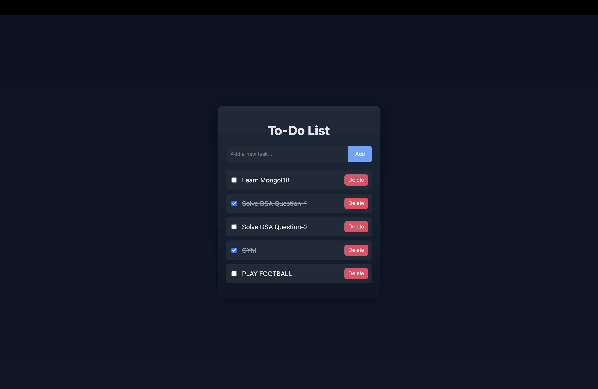

TaskMaster – Full-Stack Web Application

TaskMaster is a simple and efficient full-stack to-do list web application that helps users manage daily tasks. It allows users to add, delete, mark tasks as completed, and view all tasks with data persisted in a MySQL database.

The project demonstrates core full-stack development skills, including REST API design, database integration, and frontend-backend communication.

⸻

🚀 Features
• Add new tasks instantly
• Delete tasks when no longer needed
• Mark tasks as completed (with strikethrough UI effect)
• Persistent task storage using MySQL database
• Clean, responsive, and modern UI
• RESTful API integration using Fetch API

⸻

🛠 Tech Stack

Frontend
• HTML
• CSS
• JavaScript

Backend
• Node.js
• Express.js

Database
• MySQL

Other Tools
• Fetch API
• dotenv (for environment variables)

⸻

📁 Project Structure

TaskMaster/
├── backend/
│ ├── routes/
│ │ └── tasks.js
│ ├── db.js
│ ├── server.js
│ ├── .env
│ ├── package.json
│ └── node_modules/
│
├── frontend/
│ ├── index.html
│ ├── script.js
│ └── style.css
│
├── .gitignore
└── README.md

⸻

⚙️ Setup Instructions (Local)

1.  Clone the repository

2.  Navigate to the backend folder
    cd backend

3.  Install dependencies
    npm install

4.  Create a .env file with the following variables:
    DB_HOST=localhost
    DB_USER=your_mysql_username
    DB_PASSWORD=your_mysql_password
    DB_NAME=taskmaster

5.  Start MySQL and ensure the tasks table exists

6.  Run the server
    npm start

7.  Open in browser
    http://localhost:3000

⸻

🧠 Learning Outcomes
• Built REST APIs using Express.js
• Integrated MySQL with Node.js using async/await
• Used environment variables for secure configuration
• Implemented CRUD operations
• Improved understanding of backend architecture and project structure

⸻

🔮 Future Enhancements
• Edit task functionality
• Add due dates or task categories
• User authentication (login/signup)
• Deploy backend to cloud (Render/Railway)
• Deploy frontend to Netlify or Vercel

## 📸 Application Preview

